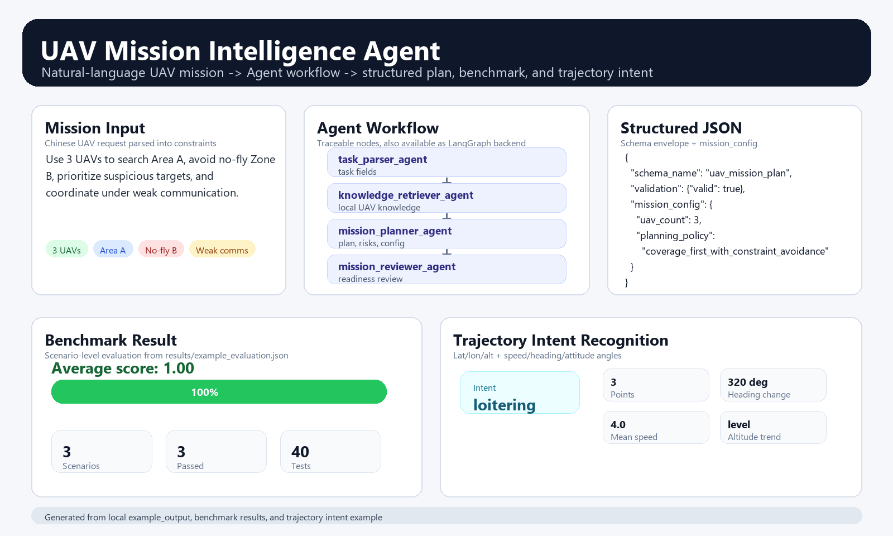
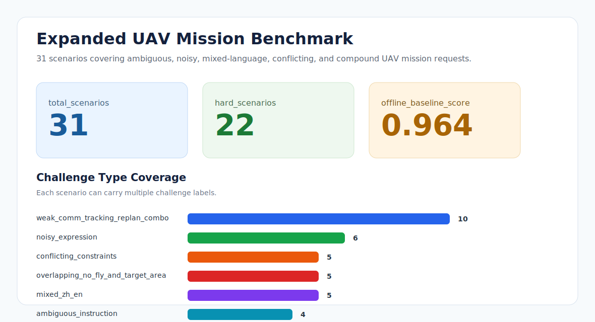

# UAV Mission Intelligence Agent

[](https://github.com/poliment/uav-mission-intelligence-agent/actions/workflows/test.yml)





> 这是一个面向无人机任务理解、规划辅助、知识检索和结构化任务配置的 LLM/Agent 项目。
>
> This is a UAV-domain LLM/Agent project for mission understanding, planning assistance, knowledge retrieval, and structured mission configuration.

UAV Mission Intelligence Agent 是一个面向无人机任务理解与任务规划辅助的公开原型项目。项目接收自然语言无人机任务请求，提取任务目标、区域、约束和协同条件，检索本地无人机规划知识，并生成包含规划建议、风险说明和 JSON 配置的结构化任务方案。当前版本默认离线运行，也支持通过 LangGraph backend、DeepSeek 或 OpenAI-compatible provider 对规划结果进行可选增强，并提供轻量 UAV trajectory intent recognition 模块。

UAV Mission Intelligence Agent is a public prototype for UAV mission understanding and planning assistance. It takes a natural-language UAV mission request, extracts mission goals, areas, constraints, and coordination conditions, retrieves local UAV planning knowledge, and generates a structured mission plan with recommendations, risks, and JSON configuration. The current version runs offline by default and can optionally refine planning results through a LangGraph backend, DeepSeek, or an OpenAI-compatible provider, and includes a lightweight UAV trajectory intent recognition module.

## Project Overview / 项目概述

本项目围绕无人机任务智能展开，重点是把自然语言任务描述转化为可解释、可评估的结构化任务方案。当前版本使用离线规则和轻量 Agent 工作流实现核心流程，并提供标准 schema 输出和可插拔 LLM provider adapter。

This project focuses on UAV mission intelligence, converting natural-language mission requests into explainable and evaluable structured mission plans. The current version uses offline rules and a lightweight Agent workflow for the core pipeline, with standard schema output and a pluggable LLM provider adapter.

| Project part / 项目部分 | Description / 内容说明 |
|---|---|
| Mission input / 任务输入 | 接收中文自然语言无人机任务描述，例如区域搜索、禁飞区规避、多机协同和弱通信约束。<br>Accepts Chinese natural-language UAV mission requests, such as area search, no-fly-zone avoidance, multi-UAV coordination, and weak-communication constraints. |
| Agent workflow / Agent 工作流 | 通过 `task_parser_agent -> knowledge_retriever_agent -> mission_planner_agent -> mission_reviewer_agent` 完成解析、检索、规划和复核。<br>Uses `task_parser_agent -> knowledge_retriever_agent -> mission_planner_agent -> mission_reviewer_agent` to parse, retrieve, plan, and review. |
| LangGraph backend / LangGraph 后端 | 保留默认无依赖 workflow，同时提供可选 LangGraph `StateGraph` backend。<br>Keeps the default dependency-free workflow while adding an optional LangGraph `StateGraph` backend. |
| Structured output / 结构化输出 | 输出任务字段、规划建议、风险说明、JSON mission configuration 和可选 schema envelope。<br>Outputs task fields, planning recommendations, risk notes, JSON mission configuration, and an optional schema envelope. |
| LLM provider / LLM 适配器 | 默认离线运行，也可以通过 DeepSeek 或 OpenAI-compatible API 对规划结果进行可选增强。<br>Runs offline by default, with optional planning refinement through DeepSeek or an OpenAI-compatible API. |
| Trajectory intent / 轨迹意图识别 | 从经纬高、速度、航向和姿态角轨迹点中提取摘要并识别飞行意图。<br>Extracts trajectory summaries from latitude, longitude, altitude, speed, heading, and attitude angles, then recognizes flight intent. |
| Benchmark / 场景评估 | 使用多场景 benchmark 评估任务解析、目标覆盖、约束覆盖和风险关键词覆盖。<br>Uses a multi-scenario benchmark to evaluate task parsing, objective coverage, constraint coverage, and risk keyword coverage. |
| Dashboard / 可视化页面 | 生成本地 HTML 页面，集中展示任务输入、Agent 节点流、规划结果和 benchmark 分数。<br>Generates a local HTML page that presents mission input, Agent node flow, planning results, and benchmark scores. |

当前版本保持离线、轻依赖，因此无需 API Key 就能快速运行。需要接入外部模型时，可以通过命令行参数启用 DeepSeek 或 OpenAI-compatible provider。

The first version is intentionally offline and dependency-light, so it can run quickly without API keys. When external model calls are needed, DeepSeek or an OpenAI-compatible provider can be enabled through CLI options.

## Key Features / 核心功能

- 解析中文无人机任务描述。<br>
  Parses Chinese UAV mission descriptions.
- 提取无人机数量、搜索区域、禁飞区、任务目标和协同约束。<br>
  Extracts UAV count, search areas, no-fly zones, objectives, and coordination constraints.
- 从本地知识库检索无人机任务规划知识。<br>
  Retrieves UAV planning knowledge from a local knowledge base.
- 生成搜索、覆盖、禁飞区规避和弱通信协同相关的规划建议。<br>
  Generates planning recommendations for search, coverage, no-fly-zone avoidance, and weak communication.
- 输出结构化 JSON 任务配置。<br>
  Outputs a structured JSON mission configuration.
- 支持 schema envelope 输出，包含 schema 名称、版本、JSON schema、校验结果和数据主体。<br>
  Supports schema envelope output with schema name, version, JSON schema, validation result, and data payload.
- 支持 DeepSeek 和 OpenAI-compatible LLM provider adapter，并保留默认离线 fallback。<br>
  Supports DeepSeek and OpenAI-compatible LLM provider adapters while keeping the default offline fallback.
- 支持可选 LangGraph backend，安装 `langgraph` 后可通过 CLI 切换。<br>
  Supports an optional LangGraph backend that can be selected from the CLI after installing `langgraph`.
- 支持 UAV trajectory intent recognition，根据轨迹摘要识别 `area_search`、`target_tracking`、`return_to_base`、`loitering` 或 `transit`。<br>
  Supports UAV trajectory intent recognition for `area_search`, `target_tracking`, `return_to_base`, `loitering`, or `transit`.
- 运行小型无人机任务 benchmark，并给出场景级评分。<br>
  Runs a mini UAV mission benchmark with scenario-level scoring.
- 提供 Agent 节点追踪和复核输出，增强可解释性。<br>
  Provides an Agent-style node trace and review output for explainability.
- 生成本地 HTML 可视化页面，展示任务输入、Agent 节点流、规划输出和 benchmark 分数。<br>
  Generates a local HTML dashboard for mission input, Agent node flow, planning output, and benchmark scores.
- 包含单元测试和示例输出，便于复现实验结果。<br>
  Includes unit tests and example output for reproducible checks.

## Example Scenario / 示例任务

下面是一个典型的中文无人机任务输入，要求 3 架无人机搜索指定区域、避开禁飞区、优先覆盖可疑目标点，并在弱通信条件下保持协同。

The following is a typical Chinese UAV mission input. It asks three UAVs to search a target area, avoid a no-fly zone, prioritize suspicious target points, and maintain coordination under weak communication.

Input / 输入：

```text
使用3架无人机搜索区域A，避开禁飞区B，优先覆盖可疑目标点，并保持弱通信条件下协同。
```

输出结果包括任务字段解析、相关无人机规划知识、规划建议、任务风险和 JSON 任务配置。

The output includes task parsing, retrieved UAV planning knowledge, planning recommendations, mission risks, and JSON mission configuration.

Representative output / 示例输出：[`examples/example_output.json`](examples/example_output.json)

## Agent Workflow / Agent 工作流

当前系统采用一个离线、无外部依赖的 Agent 图。每个节点都会读取和写入显式共享状态，最终输出可以包含 `agent_trace` 数组，用来解释哪些节点被执行、每个节点消费了什么输入、产生了什么输出。

The current implementation is a dependency-free Agent graph. Each node reads and writes an explicit shared state, and the final output can include an `agent_trace` array that explains which nodes ran, what they consumed, and what they produced.

```text
Natural-language UAV mission
        |
        v
task_parser_agent
        |
        v
knowledge_retriever_agent
        |
        v
mission_planner_agent
        |
        v
mission_reviewer_agent
        |
        v
Recommendations + Risks + JSON Config + Agent Trace
```

这种实现方式让当前原型易于运行，同时保留了向 LangGraph 多节点工作流升级的清晰路径。

This keeps the current prototype easy to run while preserving a clean path toward LangGraph-based multi-node workflows.

## Architecture / 架构说明

项目按任务解析、知识检索、规划生成、benchmark 评估、CLI 入口和 HTML 可视化进行模块化拆分，便于后续替换为真实 LLM、向量检索或 LangGraph 节点。

The project is modularized around task parsing, knowledge retrieval, planning generation, benchmark evaluation, CLI execution, and HTML visualization, making it easy to later replace components with a real LLM, vector retrieval, or LangGraph nodes.

| Module / 模块 | Responsibility / 职责 |
|---|---|
| `task_parser.py` | 从自然语言输入中提取结构化任务字段。<br>Extract structured mission fields from natural-language input. |
| `agent_graph.py` | 以可追踪 Agent 节点方式运行解析、检索、规划和复核流程。<br>Run parser, retriever, planner, and reviewer as traceable Agent nodes. |
| `langgraph_workflow.py` | 使用可选 LangGraph `StateGraph` 运行同一组任务节点。<br>Run the same mission nodes through an optional LangGraph `StateGraph`. |
| `knowledge_base.py` | 使用轻量 RAG 风格评分器检索相关无人机规划片段。<br>Retrieve relevant UAV planning snippets with a lightweight RAG-style scorer. |
| `llm_provider.py` | 提供 DeepSeek/OpenAI-compatible provider adapter 和 provider factory。<br>Provide the DeepSeek/OpenAI-compatible provider adapter and provider factory. |
| `trajectory.py` | 解析 UAV 轨迹点并计算高度、速度、航向和位移摘要。<br>Parse UAV trajectory points and compute altitude, speed, heading, and displacement summaries. |
| `intent_recognition.py` | 基于轨迹摘要识别轻量飞行意图。<br>Recognize lightweight flight intents from trajectory summaries. |
| `planner.py` | 生成规划建议、风险说明和任务配置。<br>Generate recommendations, risk notes, and mission configuration. |
| `schemas.py` | 定义标准输出 schema，并对任务方案进行轻量校验。<br>Define the public output schema and validate mission plans. |
| `workflow.py` | 编排端到端任务智能流程。<br>Orchestrate the end-to-end mission intelligence workflow. |
| `scenario_loader.py` | 加载结构化无人机 benchmark 场景。<br>Load structured UAV benchmark scenarios. |
| `evaluator.py` | 根据场景期望对任务方案进行评分。<br>Score mission plans against scenario expectations. |
| `benchmark.py` | 在场景集上运行工作流并汇总指标。<br>Run the workflow across a scenario set and summarize metrics. |
| `benchmark_v2.py` | 运行多 provider 对比，汇总质量、延迟、token usage 和成本指标。<br>Run multi-provider comparison with quality, latency, token usage, and cost metrics. |
| `costing.py` | 归一化 provider token usage，并根据可配置费率估算成本。<br>Normalize provider token usage and estimate cost from configurable pricing. |
| `dashboard.py` | 生成本地静态 HTML 可视化页面。<br>Generate a local static HTML visualization page. |
| `cli.py` | 提供命令行运行入口。<br>Provide a command-line entry point. |

项目目录结构如下，核心代码位于 `src/uav_mission_agent/`，示例、benchmark 数据、评估结果和 dashboard 分别放在独立目录中。

The project layout is shown below. Core code lives in `src/uav_mission_agent/`, while examples, benchmark data, evaluation results, and the dashboard are organized in separate directories.

```text
uav-mission-intelligence-agent/
+-- examples/
|   +-- mission_zh.txt
|   +-- example_output.json
+-- data/
|   +-- scenarios/
|       +-- area_search_low_bandwidth.json
|       +-- no_fly_zone_replan.json
|       +-- target_tracking_multi_uav.json
+-- results/
|   +-- example_evaluation.json
+-- dashboard/
|   +-- uav_mission_dashboard.html
+-- src/
|   +-- uav_mission_agent/
|       +-- benchmark.py
|       +-- benchmark_v2.py
|       +-- cli.py
|       +-- costing.py
|       +-- dashboard.py
|       +-- agent_graph.py
|       +-- evaluator.py
|       +-- intent_recognition.py
|       +-- knowledge_base.py
|       +-- langgraph_workflow.py
|       +-- llm_provider.py
|       +-- models.py
|       +-- planner.py
|       +-- schemas.py
|       +-- scenario_loader.py
|       +-- task_parser.py
|       +-- trajectory.py
|       +-- workflow.py
+-- tests/
|   +-- test_agent_graph.py
|   +-- test_benchmark.py
|   +-- test_benchmark_v2.py
|   +-- test_cli.py
|   +-- test_costing.py
|   +-- test_dashboard.py
|   +-- test_evaluator.py
|   +-- test_scenario_loader.py
|   +-- test_task_parser.py
|   +-- test_workflow.py
+-- pyproject.toml
+-- README.md
```

## Quick Start / 快速开始

先克隆仓库并进入项目目录。

First, clone the repository and enter the project directory.

```bash
git clone https://github.com/poliment/uav-mission-intelligence-agent.git
cd uav-mission-intelligence-agent
```

运行完整测试套件，确认本地环境可以正常执行。

Run the full test suite to confirm that the local environment works correctly.

```bash
python -m unittest discover -s tests -v
```

在 Windows PowerShell 中运行单条任务示例。

Run a single-mission example on Windows PowerShell.

```powershell
$env:PYTHONPATH="src"
python -m uav_mission_agent.cli "使用3架无人机搜索区域A，避开禁飞区B，优先覆盖可疑目标点，并保持弱通信条件下协同。"
```

如果希望看到 Agent 节点执行轨迹，可以使用 `--trace` 参数。

Use the `--trace` flag if you want to inspect the Agent node execution trace.

```powershell
$env:PYTHONPATH="src"
python -m uav_mission_agent.cli --trace "使用3架无人机搜索区域A，避开禁飞区B，优先覆盖可疑目标点，并保持弱通信条件下协同。"
```

如果需要标准 schema envelope 输出，可以使用 `--schema-output` 参数。

Use `--schema-output` when a standard schema envelope is needed.

```powershell
$env:PYTHONPATH="src"
python -m uav_mission_agent.cli --schema-output "使用3架无人机搜索区域A，避开禁飞区B，优先覆盖可疑目标点，并保持弱通信条件下协同。"
```

如果需要调用 DeepSeek API 对规划结果进行增强，可以设置 `DEEPSEEK_API_KEY`，并使用 `--llm-provider deepseek`。默认模型为 `deepseek-v4-flash`。

Use `DEEPSEEK_API_KEY` and `--llm-provider deepseek` to refine planning results through the DeepSeek API. The default model is `deepseek-v4-flash`.

```powershell
$env:PYTHONPATH="src"
$env:DEEPSEEK_API_KEY="your-api-key"
python -m uav_mission_agent.cli --llm-provider deepseek "使用3架无人机搜索区域A，避开禁飞区B，优先覆盖可疑目标点，并保持弱通信条件下协同。"
```

也可以使用通用 OpenAI-compatible API。

A generic OpenAI-compatible API can also be used.

```powershell
$env:PYTHONPATH="src"
$env:OPENAI_API_KEY="your-api-key"
python -m uav_mission_agent.cli --llm-provider openai-compatible --llm-model gpt-4o-mini --llm-base-url https://api.example.com/v1 "使用3架无人机搜索区域A，避开禁飞区B，优先覆盖可疑目标点，并保持弱通信条件下协同。"
```

如果需要使用 LangGraph backend，可以安装可选依赖，并通过 `--graph-backend langgraph` 切换。未安装 LangGraph 时，默认 `rule-based` backend 仍可正常运行。

Use the optional LangGraph backend by installing the extra dependency and selecting `--graph-backend langgraph`. Without LangGraph installed, the default `rule-based` backend continues to run normally.

```powershell
python -m pip install -e ".[langgraph]"
$env:PYTHONPATH="src"
python -m uav_mission_agent.cli --graph-backend langgraph "使用3架无人机搜索区域A，避开禁飞区B，并保持弱通信条件下协同。"
```

也可以直接运行 UAV trajectory intent recognition 示例。输入文件是轨迹点 JSON 数组，字段包含 `timestamp`、`latitude`、`longitude`、`altitude`、`speed`、`heading`、`roll`、`pitch` 和 `yaw`。

The UAV trajectory intent recognition example can also be run directly. The input file is a JSON array of trajectory points with `timestamp`, `latitude`, `longitude`, `altitude`, `speed`, `heading`, `roll`, `pitch`, and `yaw`.

```powershell
$env:PYTHONPATH="src"
python -m uav_mission_agent.cli --trajectory-intent examples\trajectory_intent_example.json
```

在 macOS 或 Linux 上运行单条任务示例。

Run a single-mission example on macOS or Linux.

```bash
PYTHONPATH=src python -m uav_mission_agent.cli "使用3架无人机搜索区域A，避开禁飞区B，优先覆盖可疑目标点，并保持弱通信条件下协同。"
```

运行小型 benchmark，评估任务解析、目标覆盖、约束覆盖、风险关键词和结构化配置等指标。

Run the mini benchmark to evaluate task parsing, objective coverage, constraint coverage, risk keywords, and structured configuration.

```powershell
$env:PYTHONPATH="src"
python -m uav_mission_agent.cli --benchmark data\scenarios
```

运行 Benchmark v2，查看 provider 对比、场景难度汇总、延迟、token usage 和成本统计。默认只运行离线 baseline，不需要 API key。

Run Benchmark v2 to inspect provider comparison, difficulty summary, latency, token usage, and cost statistics. The default command runs only the offline baseline and does not require an API key.

```powershell
$env:PYTHONPATH="src"
python -m uav_mission_agent.cli --benchmark-v2 data\scenarios
```

如果需要比较真实 LLM provider，可以设置 API key 后加入 `--benchmark-providers`。成本估算建议通过 `--benchmark-pricing` 显式传入当前 provider/model 的每百万 token 价格。

For real LLM provider comparison, set the API key and add `--benchmark-providers`. Cost estimation should use `--benchmark-pricing` with the current per-1M-token price for the provider/model.

```powershell
$env:PYTHONPATH="src"
$env:DEEPSEEK_API_KEY="your-api-key"
python -m uav_mission_agent.cli `
  --benchmark-v2 data\scenarios `
  --benchmark-providers offline,deepseek/deepseek-v4-flash `
  --benchmark-pricing deepseek/deepseek-v4-flash:0.00:0.00:USD
```

价格会随 provider 调整而变化，公开报告成本前请确认官方定价页，例如 [DeepSeek pricing](https://api-docs.deepseek.com/quick_start/pricing) 和 [OpenAI pricing](https://platform.openai.com/docs/pricing)。

Provider prices may change, so verify the current provider pricing before publishing live cost numbers, for example [DeepSeek pricing](https://api-docs.deepseek.com/quick_start/pricing) and [OpenAI pricing](https://platform.openai.com/docs/pricing).

代表性 benchmark 结果保存在 [`results/example_evaluation.json`](results/example_evaluation.json)。

A representative benchmark result is available at [`results/example_evaluation.json`](results/example_evaluation.json).

生成本地 HTML dashboard，用于本地运行结果检查，集中呈现任务输入、Agent 节点流、规划输出、Benchmark v2 provider 对比和成本统计。

Generate the local HTML dashboard for local result inspection, presenting the mission input, Agent node flow, planning output, Benchmark v2 provider comparison, and cost statistics in one page.

```powershell
$env:PYTHONPATH="src"
python -m uav_mission_agent.cli --dashboard dashboard\uav_mission_dashboard.html
```

生成后可以直接用浏览器打开 [`dashboard/uav_mission_dashboard.html`](dashboard/uav_mission_dashboard.html)。

After generation, open [`dashboard/uav_mission_dashboard.html`](dashboard/uav_mission_dashboard.html) directly in a browser.

也可以选择 editable install，之后直接通过模块方式运行 CLI。

You can also use an editable install and then run the CLI as a module.

```bash
python -m pip install -e .
python -m uav_mission_agent.cli "使用3架无人机搜索区域A，避开禁飞区B，优先覆盖可疑目标点，并保持弱通信条件下协同。"
```

## Sample Output Fragment / 输出片段示例

下面展示的是输出 JSON 的核心结构，包括解析后的任务、任务配置和 Agent 复核结果。

The following fragment shows the core JSON output structure, including the parsed task, mission configuration, and Agent review result.

```json
{
  "task": {
    "drone_count": 3,
    "search_areas": ["区域A"],
    "avoid_zones": ["禁飞区B"],
    "objectives": ["area_search", "coverage", "suspicious_target_search"],
    "constraints": [
      "low_bandwidth_coordination",
      "avoid_no_fly_zone",
      "multi_uav_coordination"
    ]
  },
  "mission_config": {
    "uav_count": 3,
    "coordination_mode": "distributed_low_bandwidth",
    "planning_policy": "coverage_first_with_constraint_avoidance"
  },
  "agent_review": {
    "ready": true,
    "warning_count": 0
  }
}
```

## Implementation Notes / 实现说明

- 任务领域明确，工作流围绕无人机任务规划构建，而不是通用聊天流程。<br>
  The task domain is explicit; the workflow is designed for UAV mission planning rather than generic chat behavior.
- 结构化推理清晰，系统把解析、检索、规划和配置生成拆分为不同阶段。<br>
  Structured reasoning is clear; the pipeline separates parsing, retrieval, planning, and configuration generation.
- Agent 可追踪，每个节点记录执行顺序、输入键、输出键和复核状态。<br>
  The Agent graph is traceable, recording node order, input keys, output keys, and review status.
- LLM provider 可插拔，内置 DeepSeek alias，默认离线路径不依赖外部 API。<br>
  The LLM provider is pluggable, includes a DeepSeek alias, and keeps the default offline path independent from external APIs.
- schema 输出可校验，便于下游系统稳定读取任务方案。<br>
  Schema output is validated so downstream systems can consume mission plans consistently.
- 包含 benchmark 评估，不只停留在单条示例，而是包含结构化无人机场景和评估器。<br>
  Benchmark evaluation is included through structured UAV scenarios and an evaluator, instead of only a single example.
- dashboard 用于结果检查，CLI 可以生成静态 HTML 页面，展示本地运行结果。<br>
  The dashboard supports result inspection; the CLI can generate a static HTML page for local outputs.
- RAG-ready，本地知识检索器后续可以替换为 FAISS、Chroma 或其他向量数据库。<br>
  The project is RAG-ready; the local knowledge retriever can later be replaced by FAISS, Chroma, or another vector database.
- Agent-ready，每个模块都可以进一步升级为 LangGraph 节点。<br>
  The project is Agent-ready; each module can become a LangGraph node in a future multi-agent workflow.
- 当前原型可测试、可离线运行，当前行为由单元测试覆盖，不依赖网络访问。<br>
  The current prototype is testable and offline; current behavior is covered by unit tests and runs without network access.

## Expanded Benchmark / 扩展 Benchmark

当前 benchmark 包含 31 个无人机任务场景，其中 22 个为 hard 场景、9 个为 medium 场景。数据集覆盖区域搜索、动态禁飞区重规划、多无人机目标跟踪、弱通信协同、模糊指令、冲突约束、缺少无人机数量、区域边界不完整、禁飞区与目标区重叠、中英文混合任务和噪声表达。

The current benchmark contains 31 UAV mission scenarios: 22 hard scenarios and 9 medium scenarios. The dataset covers area search, dynamic no-fly-zone replanning, multi-UAV target tracking, weak-communication coordination, ambiguous instructions, conflicting constraints, missing UAV counts, incomplete area boundaries, overlapping no-fly and target areas, mixed Chinese-English tasks, and noisy expressions.

| Challenge type / 挑战类型 | Scenario count / 场景数 |
|---|---|
| `weak_comm_tracking_replan_combo` | 10 |
| `noisy_expression` | 6 |
| `conflicting_constraints` | 5 |
| `overlapping_no_fly_and_target_area` | 5 |
| `mixed_zh_en` | 5 |
| `ambiguous_instruction` | 4 |
| `missing_uav_count` | 4 |
| `incomplete_area_boundary` | 4 |

评估维度包括无人机数量提取、搜索区域提取、禁飞区提取、目标覆盖、约束覆盖和风险关键词覆盖。

Evaluation dimensions include UAV count extraction, search area extraction, no-fly-zone extraction, objective coverage, constraint coverage, and risk keyword coverage.

Current sample result / 当前示例结果：

```text
total_scenarios: 31
average_score: 0.964
passed_runs: 29
hard_scenarios: 22
```

Benchmark v2 在 v1 场景评分基础上增加 provider comparison、difficulty summary、latency、token usage 和 estimated cost 字段，适合比较离线 baseline 与真实 LLM provider。

Benchmark v2 extends the v1 scenario score with provider comparison, difficulty summary, latency, token usage, and estimated cost fields, making it suitable for comparing the offline baseline with real LLM providers.

```text
benchmark_version: 2.0
provider_count: 1
total_runs: 31
estimated_total_cost: 0.0
```

## Live DeepSeek Provider Run / DeepSeek 真实 Provider 实验

2026-07-08 进行了一次真实 DeepSeek provider 对比实验，比较默认离线 baseline 与 `deepseek-v4-flash`。这次历史实验使用当时的 3 个无人机 benchmark 场景，并通过 Benchmark v2 记录 score、latency、token usage 和 estimated cost。当前公开 benchmark 已扩展为 31 个场景。

On 2026-07-08, a live DeepSeek provider comparison run was executed against the offline baseline and `deepseek-v4-flash`. This historical run used the then-current three UAV benchmark scenarios and recorded score, latency, token usage, and estimated cost through Benchmark v2. The public benchmark has since been expanded to 31 scenarios.

| Provider | Runs | Avg Score | Passed | Avg Latency | Estimated Cost |
|---|---:|---:|---:|---:|---:|
| `offline` | 3 | 1.00 | 3/3 | 0.633 ms | `$0.00000000` |
| `deepseek-v4-flash` | 3 | 1.00 | 3/3 | 9373.597 ms | `$0.00118972` |

DeepSeek token usage for the three scenarios:

```text
prompt_tokens: 3790
completion_tokens: 2354
total_tokens: 6144
estimated_total_cost: $0.00118972
```

Per-scenario DeepSeek results:

| Scenario | Score | Latency | Estimated Cost |
|---|---:|---:|---:|
| `area_search_low_bandwidth` | 1.00 | 10038.593 ms | `$0.00044870` |
| `no_fly_zone_replan` | 1.00 | 10709.325 ms | `$0.00046522` |
| `target_tracking_multi_uav` | 1.00 | 7372.873 ms | `$0.00027580` |

成本估算使用 2026-07-08 查询到的 [DeepSeek pricing](https://api-docs.deepseek.com/quick_start/pricing) 中 `deepseek-v4-flash` 价格：cache-miss input `$0.14 / 1M tokens`，output `$0.28 / 1M tokens`。实际成本会随 provider 价格、缓存命中和模型策略变化。

Cost was estimated using the `deepseek-v4-flash` pricing checked on 2026-07-08 from [DeepSeek pricing](https://api-docs.deepseek.com/quick_start/pricing): cache-miss input `$0.14 / 1M tokens` and output `$0.28 / 1M tokens`. Actual cost can change with provider pricing, cache hits, and model policy.

本次实验还暴露出一个工程问题：当前 Windows/Codex 环境下 Python `urllib` 访问 DeepSeek 时可能出现 TLS EOF，而 `curl.exe` 可以正常访问同一 API。因此 provider adapter 保留 `urllib` 默认路径，并在网络/TLS 类请求失败时自动 fallback 到 `curl` transport。

This run also exposed an engineering issue: in the current Windows/Codex environment, Python `urllib` may hit a TLS EOF when calling DeepSeek, while `curl.exe` can call the same API successfully. The provider adapter therefore keeps `urllib` as the default path and automatically falls back to a `curl` transport for network/TLS request failures.

## Current Test Coverage / 当前测试覆盖

当前测试套件覆盖中文无人机任务字段提取、相关知识检索、端到端输出结构、场景加载、benchmark 评分、Benchmark v2 provider/cost 统计、CLI benchmark 模式、Agent trace 输出、本地 HTML dashboard 渲染、schema output、LLM provider adapter 和 CLI dashboard 生成模式。

The current test suite validates Chinese UAV mission field extraction, relevant UAV knowledge retrieval, end-to-end workflow output structure, scenario loading, benchmark scoring, Benchmark v2 provider/cost statistics, CLI benchmark mode, Agent graph trace output, optional LangGraph backend routing, local HTML dashboard rendering, schema output, LLM provider adapter, UAV trajectory summary, trajectory intent recognition, and CLI dashboard generation mode.

Run / 运行：

```bash
python -m unittest discover -s tests -v
```

Expected result / 预期结果：

```text
Ran 53 tests
OK
```

## Roadmap / 路线图

- 扩展 LangGraph backend，增加条件边、检查点和人工复核节点。<br>
  Extend the LangGraph backend with conditional edges, checkpoints, and human review nodes.
- 用 FAISS 或 Chroma 替换本地轻量检索器。<br>
  Replace the local retriever with FAISS or Chroma.
- 增加更多 provider 后端，并补充带真实 pricing 校准的公开 cost report。<br>
  Add more provider backends and publish cost reports calibrated with current provider pricing.
- 增加面向仿真器的结构化 YAML 输出。<br>
  Add structured YAML output for simulator-style mission configuration.
- 扩展更多无人机场景，包括区域搜索、目标跟踪、禁飞区规避、弱通信和多无人机任务分配。<br>
  Add more UAV scenarios, including area search, target tracking, no-fly-zone avoidance, weak communication, and multi-UAV task allocation.
- 增加更难的 benchmark case，例如模糊指令和冲突约束。<br>
  Add harder benchmark cases with ambiguous commands and conflicting constraints.
- 在静态 dashboard 基线之后，增加交互式 Streamlit 页面或 FastAPI 服务。<br>
  Add an interactive Streamlit page or FastAPI service after the static dashboard baseline.

## Project Summary / 项目总结

构建了一个无人机领域 LLM/Agent 原型，能够将自然语言无人机任务请求转化为结构化任务方案，并结合可追踪 Agent 节点、任务解析、RAG 风格本地知识检索、可插拔 LLM provider、schema 输出、规划建议、风险解释、JSON 配置输出和 benchmark 场景评估。

Built a UAV-domain LLM/Agent prototype that converts natural-language UAV mission requests into structured mission plans by combining traceable Agent nodes, an optional LangGraph backend, task parsing, RAG-style local knowledge retrieval, a pluggable LLM provider, schema output, UAV trajectory intent recognition, planning recommendations, risk explanation, JSON configuration output, and benchmark-style scenario evaluation.
