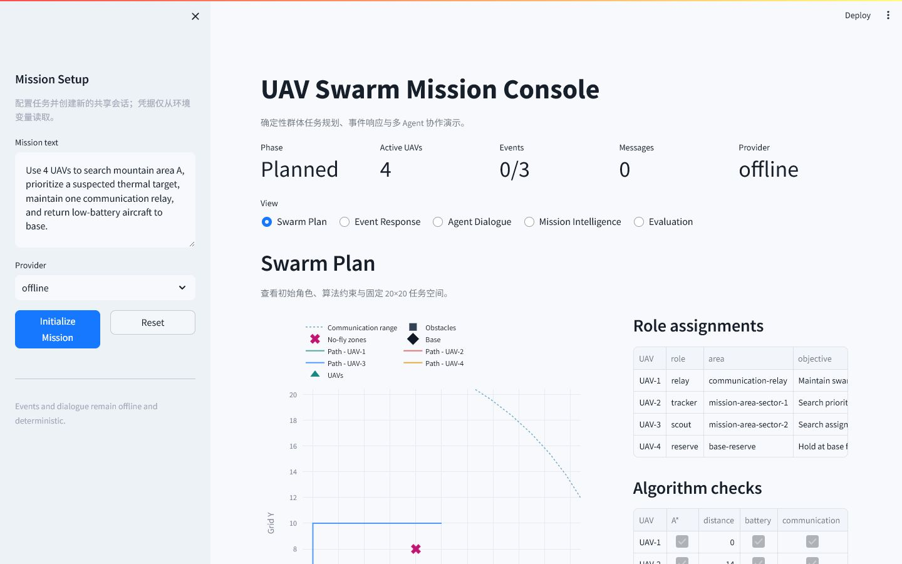

# UAV Mission Intelligence Agent

[](https://github.com/poliment/uav-mission-intelligence-agent/actions/workflows/test.yml)

## UAV Swarm Mission Console



一个离线优先、可稳定复现的无人机任务智能体原型。项目以 Python Streamlit 控制台为主界面，将自然语言任务理解、四机协同规划、确定性约束检查、事件重规划、多 Agent 消息和评测结果整合在同一会话中；FastAPI 仅提供无状态 JSON 兼容接口。

## 核心能力

- **任务理解**：解析中文自然语言任务，输出结构化任务、建议、风险、Schema 和 Agent trace。
- **集群规划**：在 20×20 网格中为四架 UAV 分配 `relay`、`tracker`、`scout`、`reserve` 等角色。
- **确定性校验**：使用 A* 路径、电量余量、通信覆盖、障碍物和禁飞区检查约束。
- **动态协作**：按固定事件顺序完成三次重规划，并生成可追踪的 Agent 消息与 memory links。
- **离线 RAG**：默认 `local-vector` 检索无需外部服务；可选 FAISS 和 Chroma 向量库适配器。
- **兼容工具**：保留单任务 CLI、Benchmark、静态 dashboard 导出、轨迹意图识别、LangGraph 工作流和在线模型增强。

默认流程不需要 API key 或网络请求。在 Swarm 流程中，确定性算法决定任务分配和事件响应，在线 provider 仅用于增强规划说明。

## 快速开始

要求 Python 3.10 或更高版本。

```powershell
git clone https://github.com/poliment/uav-mission-intelligence-agent.git
cd uav-mission-intelligence-agent
python -m pip install -e ".[demo]"
uav-mission-agent-demo --host 127.0.0.1 --port 8000
```

打开 `http://127.0.0.1:8000`。无浏览器环境可增加 `--no-browser`：

```powershell
uav-mission-agent-demo --host 127.0.0.1 --port 8000 --no-browser
```

任务文本、provider、model 和 base URL 位于侧栏。点击 `Initialize Mission` 创建会话，点击 `Reset` 恢复默认离线状态；浏览器刷新会重建本地会话。

## 控制台视图

| View | 内容 |
|---|---|
| `Swarm Plan` | 初始角色、Plotly 地图、A* 路径、电量与通信检查、provider advisory |
| `Event Response` | 使用 `Process next event` 或 `Run remaining` 推进固定事件并查看重规划 memory |
| `Agent Dialogue` | 查看结构化消息时间线、发送者、接收者、协调摘要和 memory links |
| `Mission Intelligence` | 查看单任务 Agent trace、任务执行图、校验结果和 JSON 输出 |
| `Evaluation` | 查看离线 Benchmark 与 provider comparison |

## 确定性演示流程

共享 `SwarmDemoSession` 从同一个四机初始状态出发，事件只能按以下顺序处理：

1. `target_detected`：在 `(12, 8)` 发现目标。
2. `battery_warning`：UAV-2 电量降至 `20%`。
3. `communication_degraded`：UAV-1 移动到 `(18, 18)`，通信质量降至 `0.2`。

完整流程固定产生 3 次重规划、9 条 Agent 消息和 9 个消息 memory links。重复运行使用相同事件和时间戳，便于演示、测试和回归比较。

## JSON API

安装 `demo` extra 后，可单独启动无状态 FastAPI 服务：

```powershell
uav-mission-agent-api --host 127.0.0.1 --port 8010
```

| Method | Route | 用途 |
|---|---|---|
| `GET` | `/` | 服务索引与接口清单 |
| `GET` | `/api/health` | 健康检查 |
| `POST` | `/api/mission` | 单任务规划；请求体支持 `mission_text`、`provider`、`model` |
| `GET` | `/api/benchmark` | 离线评测报告 |
| `GET` | `/api/swarm/demo-plan` | 固定场景的初始集群计划 |
| `GET` | `/api/swarm/demo-events` | 三个事件的确定性响应与重规划 memory |
| `GET` | `/api/swarm/demo-dialogue` | 事件结果、消息时间线、协调摘要和消息 memory |

三个 Swarm Demo 接口每次创建新的离线会话，因此调用之间不共享可变状态。

`/api/mission` 不接受客户端提供的 `base_url`。在线 provider 的服务地址只能通过 API 服务进程的 `DEEPSEEK_BASE_URL` 或 `OPENAI_BASE_URL` 环境变量配置，避免将服务端凭据发送到调用者指定的地址。

### API 安全边界与真实 AI 调用

`/api/mission` 会使用服务端环境变量中的 API key 向在线 provider 发起请求。如果允许调用方同时指定 `base_url`，服务端可能把凭据作为 `Authorization` 请求头发送到不受信任的地址。因此，API 请求体只允许 `mission_text`、`provider` 和 `model`；地址与密钥必须由服务端管理员配置。

真实 DeepSeek 调用可使用未纳入版本控制的 `.env` 文件：

```dotenv
DEEPSEEK_API_KEY=replace-with-real-key
DEEPSEEK_MODEL=replace-with-provider-model-id
DEEPSEEK_BASE_URL=https://api.deepseek.com
```

启动 API 服务：

```powershell
uav-mission-agent-api --env-file .env --host 127.0.0.1 --port 8010
```

从客户端提交任务时不要包含 `base_url`：

```powershell
$body = @{
  mission_text = "使用3架无人机搜索区域A，并避开禁飞区B。"
  provider = "deepseek"
  model = "replace-with-provider-model-id"
} | ConvertTo-Json

Invoke-RestMethod `
  -Uri "http://127.0.0.1:8010/api/mission" `
  -Method Post `
  -ContentType "application/json" `
  -Body $body
```

使用其他 OpenAI-compatible 服务时，在 API 服务器上设置 `OPENAI_API_KEY`、`OPENAI_MODEL` 和 `OPENAI_BASE_URL`，并将请求中的 `provider` 改为 `openai-compatible`。自定义 endpoint 仍应通过服务端环境变量或 `--env-file` 调整，不要重新允许客户端传入 `base_url`。

API 失败时返回结构化错误：

```json
{
  "status": "error",
  "error": {
    "code": "base_url_not_allowed",
    "message": "base_url is server-configured and cannot be set in API requests"
  }
}
```

| Error code | 调整策略 |
|---|---|
| `invalid_mission` | 提供非空的 `mission_text`。 |
| `unsupported_provider` | 使用 `offline`、`deepseek` 或 `openai-compatible`。 |
| `base_url_not_allowed` | 删除请求体中的 `base_url`，改在 API 服务端配置 provider 地址。 |
| `provider_error` | 检查服务端 API key、model、网络和 endpoint；需要保持演示连续时，使用 `provider: "offline"` 重新提交。 |

FastAPI 不会在在线 provider 失败后静默切换为离线模式；调用方必须明确决定是否以 `offline` 重试。Streamlit Swarm 控制台则会显示 `offline fallback`，其事件处理与 Agent dialogue 继续保持确定性。

## CLI 与扩展能力

安装项目后可通过 `uav-mission-agent` 使用单任务工作流：

```powershell
python -m pip install -e .
uav-mission-agent "使用3架无人机搜索区域A，避开禁飞区B，并保持弱通信条件下协同。"
uav-mission-agent --trace "使用3架无人机搜索区域A，避开禁飞区B。"
```

常用离线命令：

```powershell
uav-mission-agent --benchmark data\scenarios
uav-mission-agent --benchmark-v2 data\scenarios
uav-mission-agent --dashboard dashboard\uav_mission_dashboard.html
uav-mission-agent --trajectory-intent examples\trajectory_intent_example.json
```

- `--benchmark`：运行场景评测。
- `--benchmark-v2`：输出 provider、延迟、Token 和估算成本维度的扩展报告。
- `--dashboard`：导出包含任务、trace、评测和 provider comparison 的本地静态 HTML 报告。
- `--trajectory-intent`：读取轨迹 JSON 并识别飞行意图。
- `--schema-output`：用公共 Schema 包装单任务结果。
- `--graph-backend langgraph`：使用可选 LangGraph 工作流。

默认 RAG backend 为 `local-vector`，也支持 `keyword`、`faiss` 和 `chroma`。可选依赖安装方式：

```powershell
python -m pip install -e ".[rag-faiss]"
python -m pip install -e ".[rag-chroma]"
python -m pip install -e ".[langgraph]"
```

`rag-faiss` 和 `rag-chroma` 只增加对应向量库适配器；默认离线运行不依赖它们。

## 可选在线模型

支持 `deepseek` 和 `openai-compatible`。密钥仅从环境变量或未纳入版本控制的 env file 读取，控制台不提供 API key 输入框。

| Provider | 必需变量 | 可选变量 |
|---|---|---|
| DeepSeek | `DEEPSEEK_API_KEY` | `DEEPSEEK_MODEL`, `DEEPSEEK_BASE_URL` |
| OpenAI-compatible | `OPENAI_API_KEY` | `OPENAI_MODEL`, `OPENAI_BASE_URL` |

环境准备好后，可直接选择控制台中的 provider，或运行：

```powershell
uav-mission-agent --llm-provider deepseek "使用3架无人机搜索区域A"
uav-mission-agent --llm-provider openai-compatible --llm-model gpt-4o-mini "使用3架无人机搜索区域A"
uav-mission-agent-demo --env-file .env --no-browser
```

在线调用失败时，Swarm 控制台会标记 `offline fallback`；事件处理和 Agent dialogue 始终保持确定性。不要提交 env file、密钥或包含凭据的截图。

## 架构

```text
Streamlit console
    -> SwarmDemoSession
        -> SwarmCoordinator -> deterministic algorithms + grid environment
        -> SwarmDialogueEngine -> event-linked messages + memory
        -> Plotly visualization

FastAPI JSON service
    -> stateless mission, benchmark and fresh Swarm Demo payloads

Core CLI
    -> parser -> local RAG -> planner -> reviewer -> JSON/trace
    -> benchmark | dashboard export | trajectory intent
    -> optional LLM provider or LangGraph
```

`src/uav_mission_agent/` 中的确定性算法与 provider 增强彼此分离：模型可以补充建议和风险文字，但不会覆盖算法计算出的角色、路径和事件响应。

## 测试

核心测试默认离线，不需要凭据：

```powershell
python -m unittest discover -s tests -v
```

安装 Demo 与 Test extras 后，可覆盖 Streamlit AppTest、Plotly 和 FastAPI TestClient：

```powershell
python -m pip install -e ".[demo,test]"
python -m unittest discover -s tests -v
```

本地已安装 pytest 时也可运行：

```powershell
$env:PYTHONPATH="src"
python -m pytest -q
```

## 项目结构

```text
uav-mission-intelligence-agent/
+-- .streamlit/              Streamlit 主题
+-- data/scenarios/          Benchmark 场景
+-- examples/                任务、轨迹与 Swarm 示例
+-- src/uav_mission_agent/   核心源码
+-- tests/                   单元、API 与 AppTest 测试
+-- docs/assets/             README 视觉资源
+-- docs/maintenance.md      维护期未决事项与许可证决策
+-- pyproject.toml           依赖、extras 与命令入口
+-- README.md                项目使用说明
```
