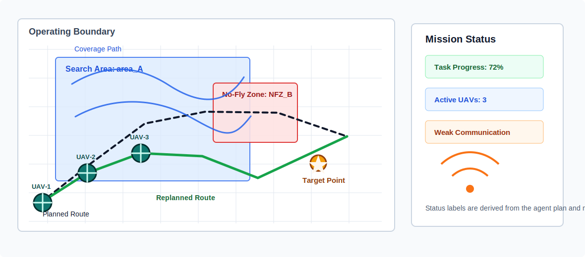

# UAV Mission Intelligence Agent

[](https://github.com/poliment/uav-mission-intelligence-agent/actions/workflows/test.yml)





## Project overview / 项目概述

UAV Mission Intelligence Agent is an offline-first UAV mission intelligence prototype. It converts natural-language mission requests into structured mission plans, retrieves local UAV planning knowledge with local vector RAG, evaluates constraints, and produces traceable JSON output for demos, benchmarks, and future simulation integration.

本项目是一个面向无人机任务理解与规划辅助的离线优先原型。它将自然语言任务请求转化为结构化任务方案，通过 local vector RAG 检索本地无人机规划知识，校验任务约束，并输出可追踪、可测试、可扩展到仿真展示的 JSON 结果。

The project is designed around a clear separation of responsibilities:

- LLM/Agent layer: mission understanding, retrieval context, planning explanation, and optional provider refinement.
- Swarm model layer: independent UAV agent state, mission events, detected targets, and swarm memory.
- Virtual environment layer: two-dimensional grid state, obstacles, no-fly zones, communication quality, battery drain, and deterministic ticks.
- Traditional algorithm layer: A* path planning, path distance, battery feasibility, communication coverage, candidate scoring, and target assignment.

## Swarm upgrade status

The swarm prototype currently includes three completed layers:

| Layer | Module | Status |
|---|---|---|
| Swarm data models | `swarm_models.py` | Models UAV agents, grid positions, detected targets, mission events, swarm memory, and mission state. |
| Virtual environment | `swarm_environment.py` | Provides a bounded 2D grid, obstacles, no-fly zones, communication checks, battery drain, target discovery, and tick events. |
| Traditional algorithms | `swarm_algorithms.py` | Uses A* path planning to find obstacle-aware routes, then runs battery, communication, scoring, and target-assignment checks. |

This keeps the project grounded in deterministic engineering logic: the LLM can explain and coordinate high-level intent, while hard constraints are checked by algorithmic tools.

## Core capabilities / 核心能力

- Parse Chinese UAV mission requests into UAV count, search areas, no-fly zones, objectives, and coordination constraints.
- Retrieve UAV planning knowledge through default offline local vector RAG with `score`, `rank`, `retriever`, and `matched_tags` evidence.
- Generate recommendations, risks, structured mission configuration, schema output, and Agent trace records.
- Run an optional LangGraph backend while preserving the dependency-free default workflow.
- Use optional DeepSeek or OpenAI-compatible providers for live refinement.
- Recognize lightweight trajectory intent from UAV trajectory summaries.
- Run benchmark and provider comparison reports with score, latency, token usage, and estimated cost.
- Render local mission visualization and an interactive FastAPI + HTML demo.
- Model multi-UAV swarm state and run deterministic grid/environment/algorithm checks.

## Architecture / 架构

```text
Natural-language UAV mission
        |
        v
task_parser_agent
        |
        v
knowledge_retriever_agent  ---> local vector RAG
        |
        v
mission_planner_agent      ---> optional DeepSeek / OpenAI-compatible provider
        |
        v
mission_reviewer_agent
        |
        v
Structured mission plan + risks + JSON config + Agent trace

Swarm extension:

SwarmMissionState
        |
        +--> SwarmGridEnvironment
        |       +-- grid, obstacle, no-fly-zone, communication, battery, target events
        |
        +--> swarm_algorithms.py
                +-- A* path planning
                +-- battery feasibility
                +-- communication coverage
                +-- candidate scoring
                +-- target assignment
```

Important modules:

| Module | Responsibility |
|---|---|
| `task_parser.py` | Extract structured fields from natural-language UAV mission text. |
| `agent_graph.py` | Run parser, retriever, planner, and reviewer nodes with trace output. |
| `knowledge_base.py`, `embeddings.py`, `retrievers.py` | Provide local vector RAG and optional FAISS/Chroma adapter boundaries. |
| `planner.py`, `schemas.py`, `workflow.py` | Generate and validate mission plans. |
| `llm_provider.py` | Support offline, DeepSeek, and OpenAI-compatible provider paths. |
| `swarm_models.py` | Define UAV agent states, mission events, detected targets, and swarm memory. |
| `swarm_environment.py` | Simulate a simple deterministic 2D swarm environment. |
| `swarm_algorithms.py` | Provide A* path planning and explainable constraint checks. |
| `mission_visualization.py`, `dashboard.py` | Render local visual outputs. |
| `demo_service.py`, `demo_app.py`, `demo_cli.py` | Serve the optional interactive demo. |
| `benchmark.py`, `benchmark_v2.py`, `evaluator.py` | Evaluate mission quality and provider comparison runs. |

## Quick start / 快速开始

Clone the repository and run the default offline test suite:

```bash
git clone https://github.com/poliment/uav-mission-intelligence-agent.git
cd uav-mission-intelligence-agent
python -m unittest discover -s tests -v
```

Run a single mission from Windows PowerShell:

```powershell
$env:PYTHONPATH="src"
python -m uav_mission_agent.cli "使用3架无人机搜索区域A，避开禁飞区B，优先覆盖可疑目标点，并保持弱通信条件下协同。"
```

Show Agent trace:

```powershell
$env:PYTHONPATH="src"
python -m uav_mission_agent.cli --trace "使用3架无人机搜索区域A，避开禁飞区B，并保持弱通信条件下协同。"
```

Generate schema-wrapped output:

```powershell
$env:PYTHONPATH="src"
python -m uav_mission_agent.cli --schema-output "使用3架无人机搜索区域A，避开禁飞区B，并保持弱通信条件下协同。"
```

Run the expanded benchmark:

```powershell
$env:PYTHONPATH="src"
python -m uav_mission_agent.cli --benchmark data\scenarios
```

Run Benchmark v2 with provider comparison fields. The default run uses only the offline provider:

```powershell
$env:PYTHONPATH="src"
python -m uav_mission_agent.cli --benchmark-v2 data\scenarios
```

Generate the local HTML dashboard:

```powershell
$env:PYTHONPATH="src"
python -m uav_mission_agent.cli --dashboard dashboard\uav_mission_dashboard.html
```

## RAG retrieval / RAG 检索

The default retrieval backend is local vector RAG. It uses deterministic sparse vectors and cosine similarity, so it runs without API keys, network calls, FAISS, Chroma, or embedding services.

Optional vector-store boundaries are available through extras:

```powershell
python -m pip install -e ".[rag-faiss]"
python -m pip install -e ".[rag-chroma]"
```

Supported backend names:

- `local-vector`
- `keyword`
- `faiss` via the `rag-faiss` extra
- `chroma` via the `rag-chroma` extra

## A* swarm algorithm layer

`swarm_algorithms.py` uses A* path planning over the Stage 2 grid environment. It treats obstacles, no-fly zones, and map boundaries as blocked cells, then exposes the resulting path to other checks:

- `astar_path(...)`: shortest obstacle-aware grid path.
- `check_battery_feasibility(...)`: required travel battery plus reserve.
- `check_communication_coverage(...)`: weak communication points along the A* path.
- `score_candidate_for_target(...)`: explainable UAV-to-target score.
- `assign_targets_to_uavs(...)`: deterministic greedy target assignment.

This layer is intentionally deterministic. It gives future coordinators and demos a reliable tool surface for "can this UAV execute this assignment?" before any LLM-generated explanation is accepted.

## Interactive Demo / 交互式 Demo

Install optional demo dependencies:

```powershell
pip install -e ".[demo]"
```

Start the local offline demo:

```powershell
uav-mission-agent-demo --host 127.0.0.1 --port 8000
```

Run with a local env file for DeepSeek without writing secrets into the repository:

```powershell
uav-mission-agent-demo --env-file D:\epacode\working\.secrets\deepseek.env
```

Open `http://127.0.0.1:8000` after the server starts. The demo supports mission input, provider selection, Agent trace, structured JSON output, provider comparison, and mission visualization.

## Example output / 示例输出

Representative output:

- [`examples/example_output.json`](examples/example_output.json)
- [`results/example_evaluation.json`](results/example_evaluation.json)
- [`docs/assets/mission-execution-visualization.svg`](docs/assets/mission-execution-visualization.svg)

Typical mission input:

```text
使用3架无人机搜索区域A，避开禁飞区B，优先覆盖可疑目标点，并保持弱通信条件下协同。
```

Output includes:

- Parsed task fields.
- Retrieved UAV planning knowledge.
- Planning recommendations.
- Risks.
- JSON mission configuration.
- Optional schema envelope.
- Optional Agent trace.

## Testing / 测试

Run the full suite:

```bash
python -m unittest discover -s tests -v
```

Or with pytest:

```bash
PYTHONPATH=src python -m pytest
```

The test suite is offline by default and uses fake or local providers only. CI does not require API keys.

## Project structure / 项目结构

```text
uav-mission-intelligence-agent/
+-- data/scenarios/                 benchmark scenario data
+-- dashboard/                      generated local dashboard
+-- docs/assets/                    README and dashboard visuals
+-- docs/superpowers/               design and implementation notes
+-- examples/                       sample mission and trajectory inputs
+-- results/                        sample benchmark outputs
+-- src/uav_mission_agent/          project source modules
+-- tests/                          unit tests
+-- pyproject.toml
+-- README.md
```

## Provider and key hygiene

Live provider calls are optional. The default path is offline.

For DeepSeek:

```powershell
$env:DEEPSEEK_API_KEY="your-api-key"
$env:PYTHONPATH="src"
python -m uav_mission_agent.cli --llm-provider deepseek "use 3 UAVs to search area A"
```

For OpenAI-compatible APIs:

```powershell
$env:OPENAI_API_KEY="your-api-key"
$env:PYTHONPATH="src"
python -m uav_mission_agent.cli --llm-provider openai-compatible --llm-model gpt-4o-mini --llm-base-url https://api.openai.com/v1 "use 3 UAVs to search area A"
```

Keep API keys in environment variables or local env files. Do not commit keys, screenshots containing keys, or private env files.

## Roadmap / 路线图

- Connect the swarm algorithm layer to a high-level swarm coordinator.
- Add dynamic replanning demos for low battery, target discovery, and weak communication.
- Expose swarm plan, event, and dialogue demos through the FastAPI UI.
- Extend benchmark coverage for role assignment, A* feasibility, and communication constraints.
- Add richer visualization for multi-UAV grid movement and event timelines.
